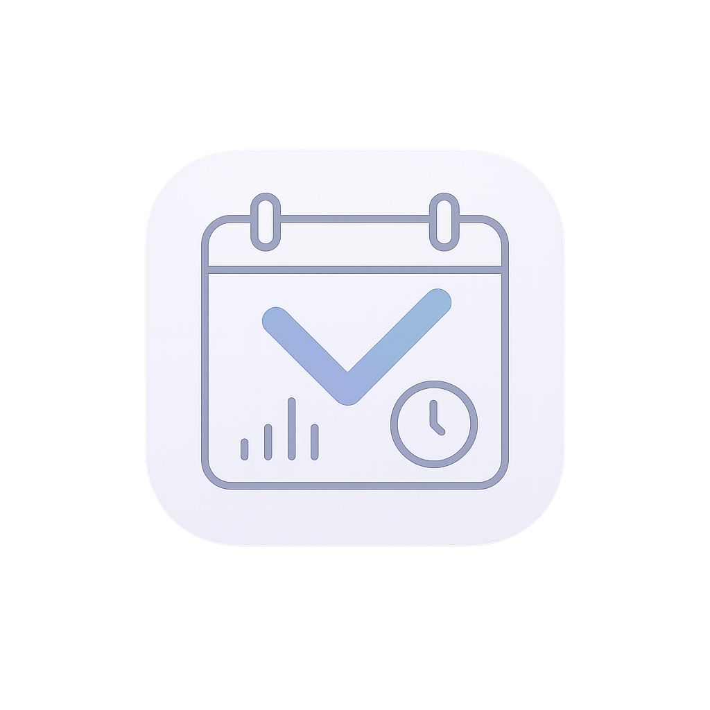

# 🚀 STUDENT PORTAL XTREME 🚀


> **Not your grandma's student portal. This is education on STEROIDS!** 💪💯

<p align="center">
  
</p>

## 🔥 FEATURES THAT WILL MELT YOUR BRAIN 🔥

- 📚 **ATTENDANCE TRACKING**: Never miss a class again (unless you want to)
- ⏰ **TIMETABLE MANAGEMENT**: Schedule optimization that would make NASA jealous
- 🏆 **DEADLINE CRUSHER**: Turn in assignments so fast your professors will get whiplash
- 🎯 **GRADE VISUALIZATION**: Watch your GPA soar with mind-blowing charts
- 🌙 **DARK MODE**: Because light mode is for the weak
- 🚄 **INSANELY FAST**: Loads faster than your professor can say "pop quiz"

## 💻 TECH STACK OF THE GODS 💻

This beast is built with the finest technologies known to mankind:

- **Flutter**: UI framework so smooth it should be illegal
- **Provider**: State management that will make you question reality
- **Animations**: So buttery you'll need a napkin
- **Shared Preferences**: Because we remember everything (like that embarrassing presentation)
- **Lottie**: Animations that hypnotize mere mortals

## 📲 INSTALLATION (IF YOU DARE) 📲

```bash
# Clone this repository (brace yourself)
git clone https://github.com/your-username/student-portal.git

# Enter the lair
cd student-portal

# Summon the dependencies
flutter pub get

# Launch the beast
flutter run
```

## 🧙‍♂️ USAGE 🧙‍♂️

1. Login with your credentials (or don't, we're not your mom)
2. Behold the dashboard of ultimate knowledge
3. Navigate through the app with the grace of a digital ninja
4. Watch your academic life transform before your very eyes

## 🔮 COMING SOON 🔮

- **AI HOMEWORK HELPER**: Not cheating, just "academic assistance"
- **PROFESSOR MIND READER**: Know what's on the test before your professor does
- **QUANTUM GRADE CALCULATOR**: Calculates your final grade across multiple dimensions
- **EXCUSE GENERATOR**: For when you need a reason why your assignment is late

## 🛡️ LICENSE 🛡️

This software is licensed under the "Don't Be Evil Unless It's Funny" license.

## 🙏 ACKNOWLEDGEMENTS 🙏

- Coffee ☕ - The true hero behind this project
- Stack Overflow - For copying... err... "researching" solutions
- The voices in our heads - For the constant "encouragement"
- You - For having the excellent taste to use this app

---

<p align="center">
  <b>Built with blood, sweat, tears, and a concerning amount of energy drinks.</b>
</p>

<p align="center">
  <i>If you're still reading this README, you should probably go study instead.</i>
</p>
